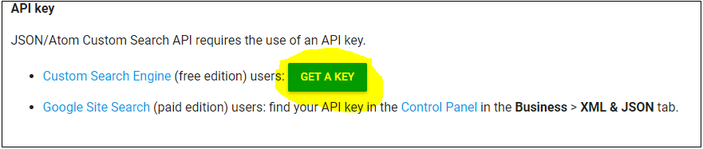

# Colour Think


A web app designed to provide creative inspiration through random Google image searches and colours.  

***

# Set Up
## Online
The live site is probably the easiest way to check this out. If it's still being
deployed by Heroku you can find it [here](https://colour-think.herokuapp.com/)


## Offline
Chances are that quite soon in the future this will be pulled off heroku, so if it is there is an offline option. Although, it's far more tedious than just clicking an active link.

#### Clone this repository

```
 $ cd /wherever/you/want/to/clone/colour-think
 $ git clone https://github.com/whatsrupp/colour-think
```

#### Set up your Google Custom Search API Key

This project uses the Google custom search API which requires an account and a key. Unfortunately it's capped at 100 queries a day so I ain't sharing! Luckily, it's simple to set up your own. Head to the API help below and generate your own key.

[Custom Search JSON API overview page](https://developers.google.com/custom-search/json-api/v1/overview)

The image below may help




#### Configuring an env.rb file
To use the search API you'll need to integrate your api key into the app. The following commands will do that for you. NB the key used here is an example of what yours should look like

```
$ touch colour-think/app/env.rb
$ echo "ENV['google_search_key'] = 'Ibsjycak-4QEUFPq7eI0a85-tNvqwsk8fyqxEs'" >> colour-think/app/env.rb
```

#### Run the app
This a rack application. Run rackup in the terminal and it should set up a local server
```
$ rackup
```

you should then see something alon the lines of
```
* Version 3.9.1 (ruby 2.3.3-p222), codename: Private Caller
* Min threads: 0, max threads: 16
* Environment: development
* Listening on tcp://localhost:9292
Use Ctrl-C to stop
```

#### Open the local host on the browser
If you've made it this far all you need to do is open up the local server with a browser.
This [link](http://localhost:9292/) will direct you to the appropriate local host.
```
http://localhost:9292/
```
## User Stories

The MVP was defined by the following user stories

```
As a User
So that I have a variety of colours
I want to be able to choose from Red, Pink, Orange, Yellow, Green, Blue and Purple
```

```
As a User
So that I can get inspiration
I want to be given a random search term with my colour
```

```
As a User
So that I can be
The colours must be presented in square
```

```
As a User
So that I'm not overwhelmed with searches
I want to only see the top 5 results
```

```
As a User
So I can dive further down the creative rabbithole
I want to be able to click on the first Image as a URL link
```

```
As a User
So that I can return to my previous searches
I want to see a chronological list of historic searches
```

```
As a User
So that I can have information about old searches
I want to see the Date, Time, Noun, Colour and Http Response
```
```
As a User
so that I can live in the past
I want to re-run my old searches
```
